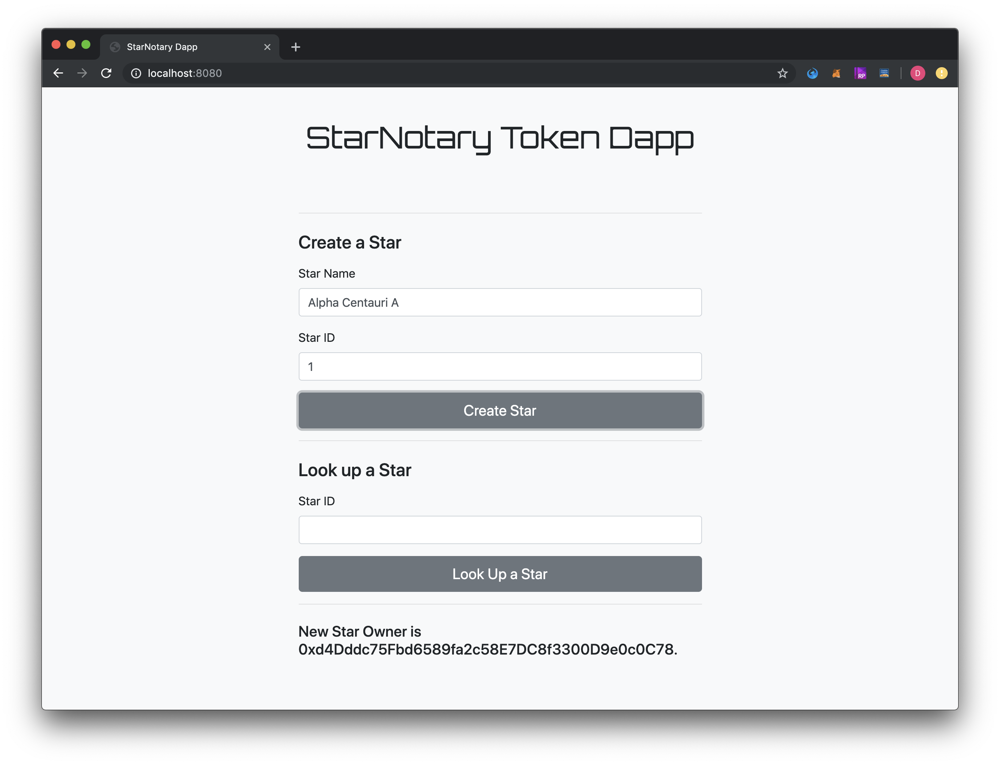
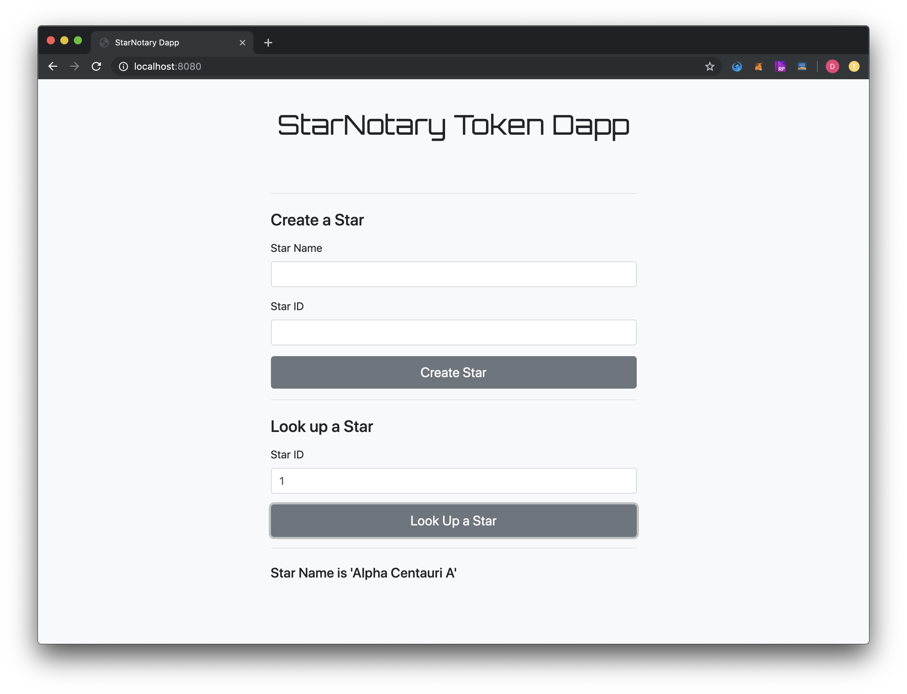

# Ethereum Dapp with ERC721 Token

This project was to build an Ethereum Dapp with ERC721 token.

## Crypto Star Token
A Decentralized Star Notary:

 - ERC-721 Token Name: CST
 - ERC-721 Token Symbol: Crypto Star Token
 - Contract Address: [0xA9FD6C957D110e991aA16f3C7870465C3e277753](https://rinkeby.etherscan.io/address/0xA9FD6C957D110e991aA16f3C7870465C3e277753#cod) (Rinkeby)
 - Truffle Version: v5.0.27
 - OpenZeppelin Version: v2.3.0

1. Creating a Star
    

2. Look up a Star
    